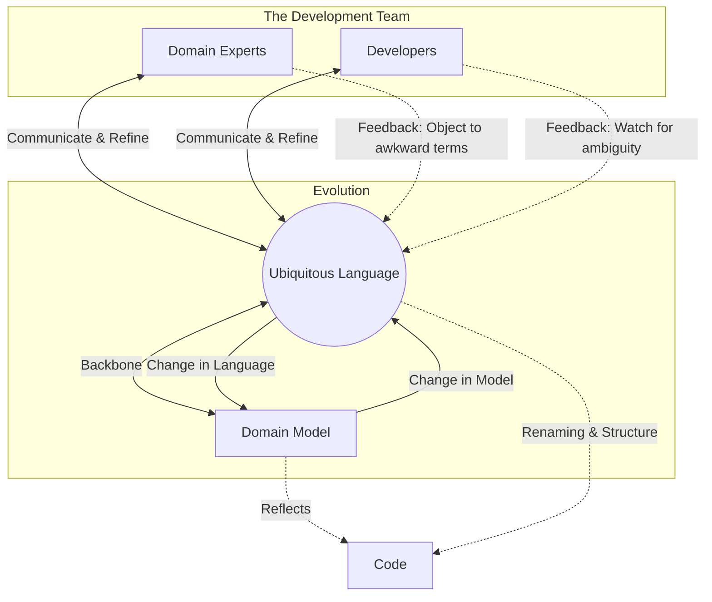

# Relationship between DDD and Ubiquitous Language

In Domain-Driven Design, the Ubiquitous Language and the Domain Model are not independent entities; they are deeply intertwined. The model serves as the backbone of the language, and the language is the primary vehicle for communicating and refining the model.

## The Model as the Backbone

As Eric Evans describes, the team must commit to exercising the language relentlessly. The language is used in diagrams, writing, speech, and—critically—in the code itself. 

- **Dynamic Knowledge:** The language carries knowledge in a dynamic form. Discussion brings the diagrams and code to life.
- **Feedback Loops:** A change in the Ubiquitous Language is a change to the model. Conversely, difficulties in expressing concepts in the language often reveal flaws or awkwardness in the underlying model.
- **Refactoring:** When the language evolves to better reflect domain understanding, the code must be refactored (renaming classes, methods, etc.) to remain in sync.

## Visualizing the Relationship

The following diagram illustrates how Domain Experts and Developers interact through the Ubiquitous Language, and how that language is anchored by the Domain Model and manifested in the Code.

## Core Principles from the Source
- **Relentless Use:** Use the language everywhere: code, speech, and diagrams.
- **Experimentation:** Use alternative expressions to explore alternative models.
- **Alignment:** Domain experts ensure the language conveys domain understanding; developers ensure it is consistent and unambiguous for design.

## References and Evidences
- **Eric Evans, "Domain-Driven Design: Tackling Complexity in the Heart of Software"**: pp. 26-27. [Link to Book](https://www.amazon.com/Domain-Driven-Design-Tackling-Complexity-Software/dp/0321125215)
- **Domain Language**: Ubiquitous Language summary. [https://www.domainlanguage.com/ddd/ubiquitous-language/](https://www.domainlanguage.com/ddd/ubiquitous-language/)
- **Martin Fowler**: "UbiquitousLanguage" pattern description. [https://martinfowler.com/bliki/UbiquitousLanguage.html](https://martinfowler.com/bliki/UbiquitousLanguage.html)
